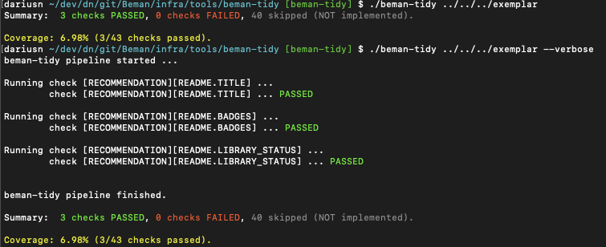

# beman-tidy: The Codebase Bemanification Tool

<!--
SPDX-License-Identifier: Apache-2.0 WITH LLVM-exception
-->

## Description

`beman-tidy` is a tool used to check and apply [The Beman Standard](https://github.com/bemanproject/beman/blob/main/docs/BEMAN_STANDARD.md).

Purpose: The tool is used to `check` (`--dry-run`) and `apply` (`--fix-inplace`) the Beman Standard to a repository.
Note: `2025-06-07`: In order to make the best and quickly use of the tool in the entire organization, most of the checks will not support the `--fix-inplace` flag in the first iteration.

## Installation

```shell
$ make install
# or
$ pip3 install -r requirements.txt
```

## Usage



* Display help:
```shell
$ ./beman-tidy --help
usage: beman-tidy [-h] [--fix-inplace | --no-fix-inplace] [--verbose | --no-verbose] [--checks CHECKS] repo_path

positional arguments:
  repo_path             path to the repository to check

optional arguments:
  -h, --help            show this help message and exit
  --fix-inplace, --no-fix-inplace
                        Try to automatically fix found issues (default: False)
  --verbose, --no-verbose
                        print verbose output for each check (default: False)
  --checks CHECKS       array of checks to run
```

* Run beman-tidy on the exemplar repository (default: dry-run mode)

```shell
# non-verbose mode
$ ./beman-tidy ../../../exemplar
Summary:  3 checks PASSED, 0 checks FAILED, 40 skipped (NOT implemented).

Coverage: 6.98% (3/43 checks passed).

# verbose mode - no errors
$ ./beman-tidy ../../../exemplar --verbose
beman-tidy pipeline started ...

Running check [RECOMMENDATION][README.TITLE] ...
	check [RECOMMENDATION][README.TITLE] ... PASSED

Running check [RECOMMENDATION][README.BADGES] ...
	check [RECOMMENDATION][README.BADGES] ... PASSED

Running check [RECOMMENDATION][README.LIBRARY_STATUS] ...
	check [RECOMMENDATION][README.LIBRARY_STATUS] ... PASSED


beman-tidy pipeline finished.

Summary:  3 checks PASSED, 0 checks FAILED, 40 skipped (NOT implemented).

Coverage: 6.98% (3/43 checks passed).

# verbose mode - with errors
$ ./beman-tidy ../../../exemplar --verbose
beman-tidy pipeline started ...

Running check [RECOMMENDATION][README.TITLE] ...
[WARNING        ][README.TITLE             ]: The first line of the file '/Users/dariusn/dev/dn/git/Beman/exemplar/README.md' is invalid. It should start with '# beman.exemplar: <short_description>'.
	check [RECOMMENDATION][README.TITLE] ... FAILED

Running check [RECOMMENDATION][README.BADGES] ...
	check [RECOMMENDATION][README.BADGES] ... PASSED

Running check [RECOMMENDATION][README.LIBRARY_STATUS] ...
	check [RECOMMENDATION][README.LIBRARY_STATUS] ... PASSED


beman-tidy pipeline finished.

Summary:  2 checks PASSED, 1 checks FAILED, 40 skipped (NOT implemented).

Coverage: 4.65% (2/43 checks passed).
```

* Run beman-tidy on the exemplar repository (fix issues in-place):

```shell
$ ./beman-tidy ../exemplar --fix-inplace --verbose
```

## beman-tidy Development

Please refer to the [Beman Tidy Development Guide](./docs/dev-guide.md) for more details.